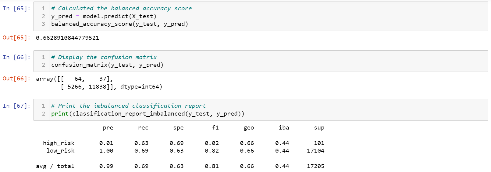

# Credit Risk Analysis

## Overview
Credit risk is an unbalanced classification problem, as good loans easily outnumber risky loans. For that reason, we employed different techniques to train and evaluate models with unbalanced classes like **imbalanced-learn** and **scikit-learn** libraries to build and evaluate models using resampling. For this challenge, we used the credit card credit dataset from LendingClub, a peer-to-peer lending services company, to oversample the data using the **RandomOverSampler** and **SMOTE** algorithms, and undersample the data using the **ClusterCentroids** algorithm. Then, we used a combinatorial approach of over-and undersampling using the **SMOTEENN** algorithm. Finally, we compared two new machine learning models that reduce bias: **BalancedRandomForestClassifier** and **EasyEnsembleClassifier**, to predict credit risk.

## Results

<ins>**Oversampling**</ins>

- Naive Random Oversampling

- SMOTE Oversampling

**Undersampling**

- Cluster Centroids

- SMOTEENN Combination (Over and Under) Sampling

**Ensemble Learners**

- Balanced Random Forest Classifier

- Easy Ensemble AdaBoost Classifier

## Summary

    
